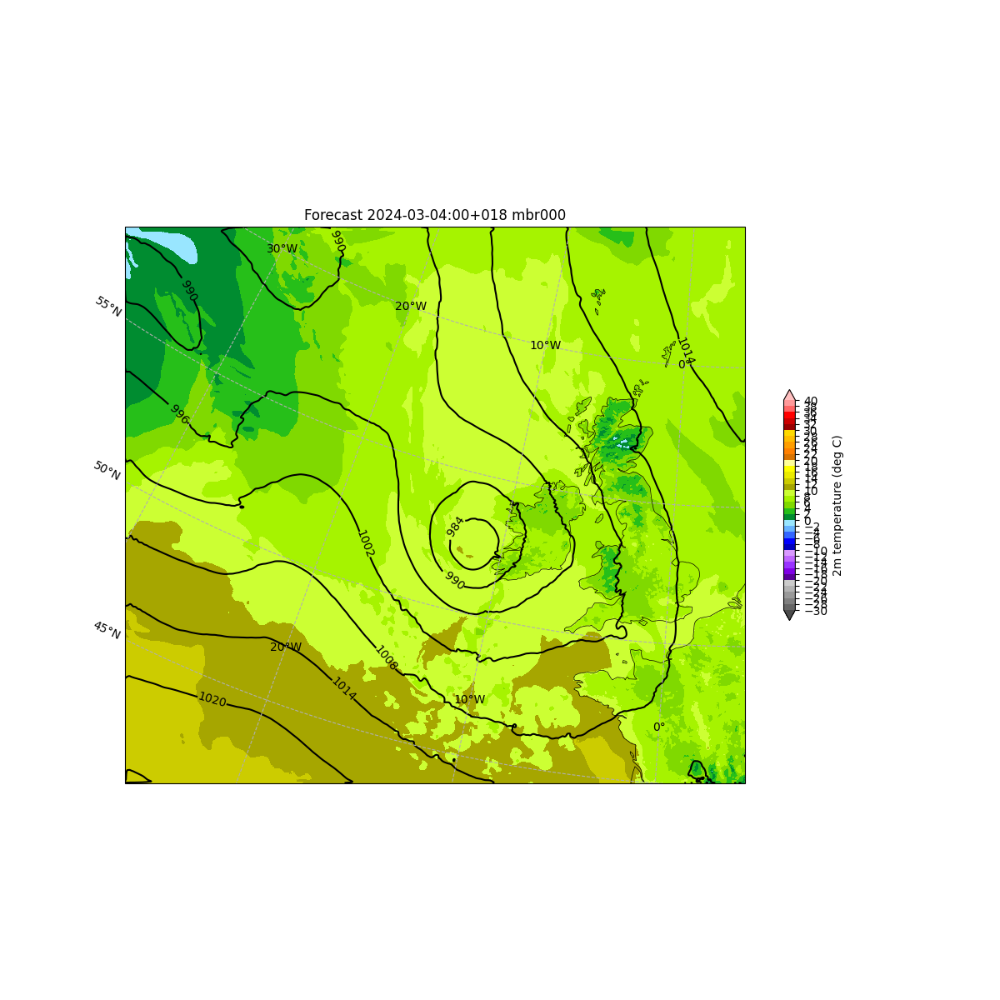
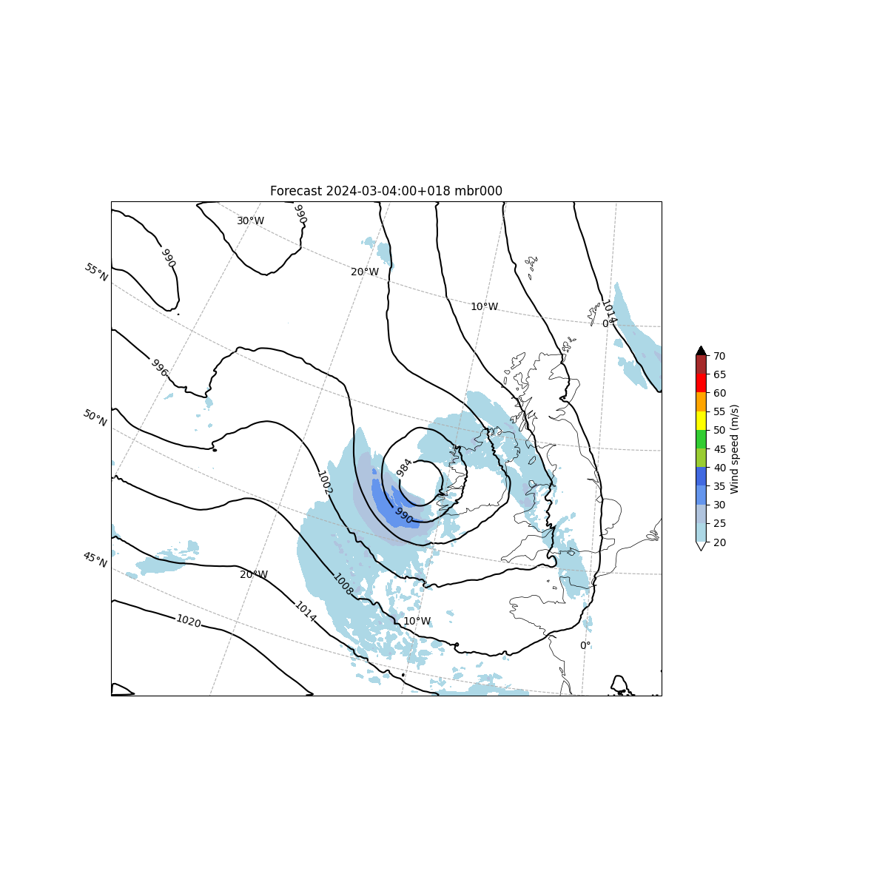
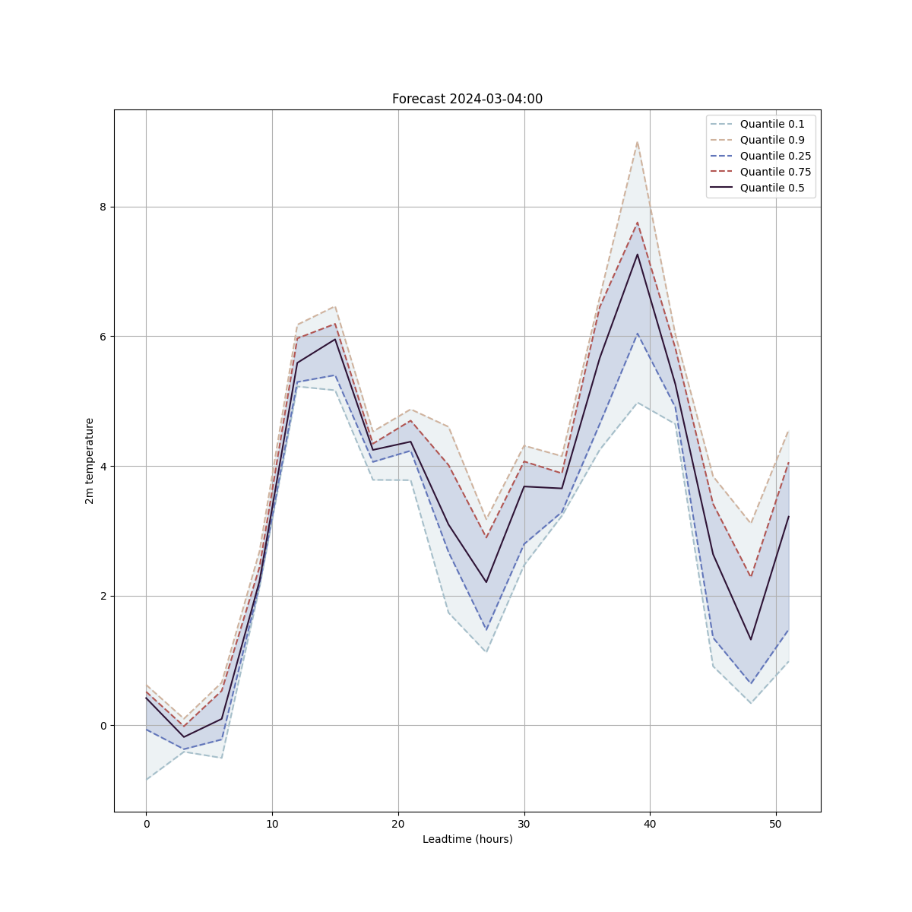
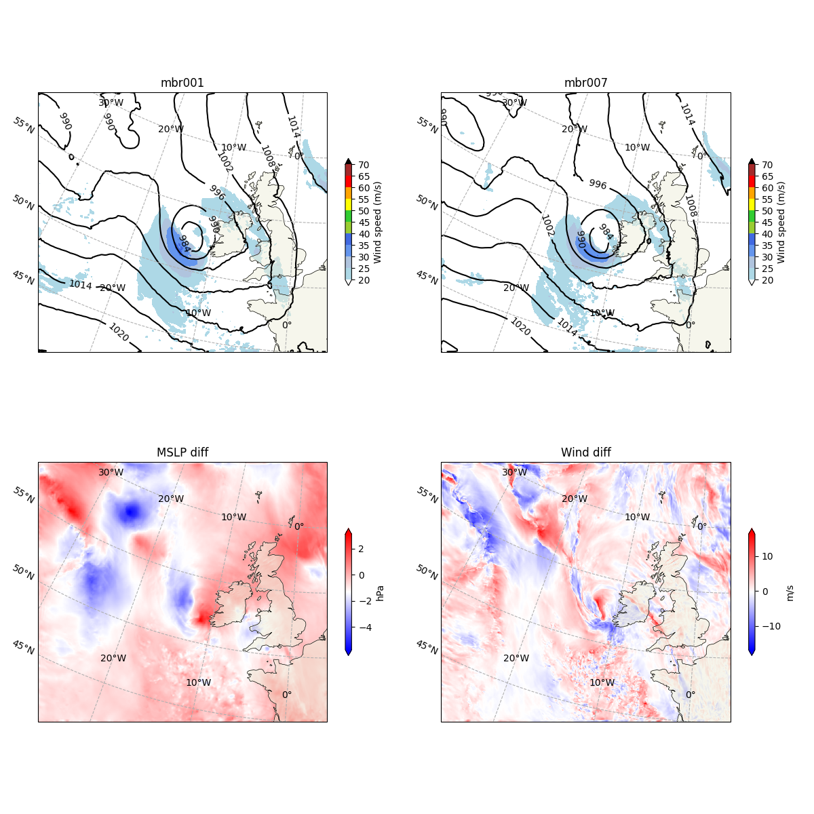

Metplotlib
========================
Meteorological plotting utilities


Why another package?
--------------------

### Multiple data formats and reading tools

Meteorological data are often stored in various formats (GRIB, netcdf, Zarr...), with various tools to read them.
Sometimes these tools include plotting functions (e.g. [EPyGrAM](https://github.com/UMR-CNRM/EPyGrAM)), sometimes they don't (e.g. [cfgrib](https://github.com/ecmwf/cfgrib))

Metplotlib aims to be **source-agnostic**: you load the data the way you prefer, metplotlib does the plots

### Complex dependencies and installation

Many of the existing tools are specific to an institution or a computing platform.
Some dependencies may not be public, or the installation may complex, sometimes requiring super-user rights.

Metplotlib aims to be based on a **limited set of widely used dependencies**, namely: [Numpy](https://numpy.org/), [Matplotlib](https://matplotlib.org/), [Cartopy](https://scitools.org.uk/cartopy/docs/latest/).


Installation
------------

### Install dependencies and this package with pip

Activate you favorite environment and make sure have all the required dependencies. With `pip` it would be:
```
pip install -r requirements.txt
```

Once you have cloned the `metplotlib` package locally, go to the package root directory (where there is the `setup.py`) and run
```
pip install -e .
```

### Check the installation

The environment must be activated each time you want to use the package.
To check the installation:
```
python tests/import_tests.py
```


Usage
------

### Make commonly used plots

For example, to make a plot with the mean sea level pressure isolines over 2-m temperature color levels:
```
from metplotlib import plots
mslp, t2m, lon, lat = ...replace with your favorite way of loading data...
fig, ax = plots.twovar_plot(mslp, t2m, lons=lon, lats=lat, cl_varfamily = "temp")
fig.show()
```



Same example with wind speed instead of 2-m temperature:
```
from metplotlib import plots
mslp, wind, lon, lat = ...replace with your favorite way of loading data...
fig, ax = plots.twovar_plot(mslp, wind, lons=lon, lats=lat, cl_varfamily = "wind")
fig.show()
```


One more example, for ensemble forecasts at a specific location represented by quantiles time series:
```
from metplotlib import plots
temp = ...ndarray of shape (n_mbr, n_ldt)...
leadtimes = ...ndarray of shape (n_ldt,)...
fig, ax = plots.quantiles(temp, x=leadtimes, xlabel="Leadtime (hours)", ylabel="2m temperature", title = f"Forecast ...")
fig.show()
```


### More advanced plots

To compare two variables in two different states:
```
from metplotlib import plots
mslp0, mslp1, wind0, wind1, lon, lat = ...replace with your favorite way of loading data...
fig, ax = plots.twovar_comparison(mslp0, mslp1, wind0, wind1, lons=lon, lats=lat)
fig.show()
```



### Make animations

...still to be done...


More infos
----------

### Contributing

Contributions are welcome! Please open issues and merge requests with your contributions.
Contributors are asked to keep their code clean and easy to read.
In particular, the following conventions are used:
  * For indentation, use spaces, avoid tabs (only tolerated to ensure consistency)
  * Class names use camel case (`ThisIsCamelCase`), function names and variables names use snake case (`this_is_snake_case`), global variables are upper case.
  * The `metplotlib` folder must contain exclusively packages and modules. No main code nor data are allowed. Main codes (files that can be run using `python file.py`) are meant to be stored in other directories than `metplotlib` (for example, in `examples`). Symmetrically, no importable functions or classes should be define outside of the `metplotlib` directory.
  * Use [Black](https://black.readthedocs.io/en/stable/index.html) and [Isort](https://pycqa.github.io/isort/) before submitting a merge request.

### License:

MIT licence
