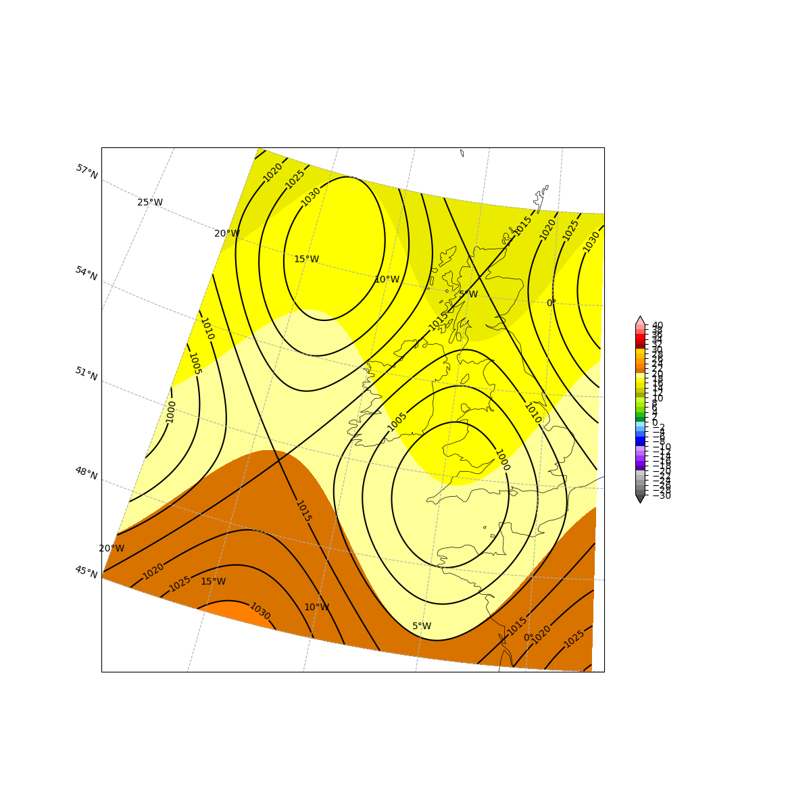

Metplotlib
========================
Meteorological plotting utilities


Why another package?
--------------------

### Multiple data formats and reading tools

Meteorological data are often stored in various formats (GRIB, netcdf, Zarr...), with various tools to read them.
Sometimes these tools include plotting functions (e.g. [EPyGrAM](https://github.com/UMR-CNRM/EPyGrAM)), sometimes they don't (e.g. [cfgrib](https://github.com/ecmwf/cfgrib))

Metplotlib aims to be **source-agnostic**: you load the data the way you prefer, metplotlib does the plots

### Complex dependencies and installation

Many of the existing tools are specific to an institution or a computing platform.
Some dependencies may not be public, or the installation may complex, sometimes requiring super-user rights.

Metplotlib aims to be based on a **limited set of widely used dependencies**, namely: [Numpy](https://numpy.org/), [Matplotlib](https://matplotlib.org/), [Cartopy](https://scitools.org.uk/cartopy/docs/latest/).


Installation
------------

### From Github

With uv (recommended):
```bash
uv add metplotlib@git+https://github.com/ThomasRieutord/metplotlib
```

With pip:
```bash
pip install metplotlib@git+https://github.com/ThomasRieutord/metplotlib
```

### In editable mode

If you wish to contribute, please see the guidelines in the [Contributing](#contributing) section.

Once you have cloned the `metplotlib` package locally, activate your favorite environment, go to the package root directory (where there is the `pyproject.toml`) and run
```bash
git clone git@github.com:ThomasRieutord/metplotlib.git
cd metplotlib
pip install -e .
```

### Check the installation

The environment must be activated each time you want to use the package.
To check the installation:
```bash
python tests/import_test.py
python -i tests/two_vars_test.py
```


Usage
-----

### Make commonly used plots

For example, to make a plot with the mean sea level pressure isolines over 2-m temperature color levels:
```python
from metplotlib import plots
mslp, t2m, lon, lat = ...replace with your favorite way of loading data...
fig, ax = plots.twovar_plot(mslp, t2m, lons=lon, lats=lat, cl_varfamily = "temp")
fig.show()
```


Same example with wind speed instead of 2-m temperature:
```python
from metplotlib import plots
mslp, wind, lon, lat = ...replace with your favorite way of loading data...
fig, ax = plots.twovar_plot(mslp, wind, lons=lon, lats=lat, cl_varfamily = "wind")
fig.show()
```


One more example, for ensemble forecasts at a specific location represented by quantiles time series:
```python
from metplotlib import plots
temp = ...ndarray of shape (n_mbr, n_ldt)...
leadtimes = ...ndarray of shape (n_ldt,)...
fig, ax = plots.quantiles(temp, x=leadtimes, xlabel="Leadtime (hours)", ylabel="2m temperature", title = f"Forecast ...")
fig.show()
```


### More advanced plots

To compare two variables in two different states:
```python
from metplotlib import plots
mslp0, mslp1, wind0, wind1, lon, lat = ...replace with your favorite way of loading data...
fig, ax = plots.twovar_comparison(mslp0, mslp1, wind0, wind1, lons=lon, lats=lat)
fig.show()
```


To plot data into a different projections than that initially provided:
```python
import numpy as np
import cartopy.crs as ccrs
from metplotlib import plots

lambert_proj_params = {
    "a": 6367470,
    "b": 6367470,
    "lat_0": 53.5,
    "lat_1": 53.5,
    "lat_2": 53.5,
    "lon_0": 5.0,
    "proj": "lcc",
}
# Figure CRS: what the figure will look like
fig_crs = ccrs.LambertConformal(
    central_longitude=lambert_proj_params["lon_0"],
    central_latitude=lambert_proj_params["lat_0"],
    standard_parallels=(lambert_proj_params["lat_1"], lambert_proj_params["lat_2"]),
)
# Data CRS: how the data is stored
data_crs = ccrs.PlateCarree()

nx, ny = (245, 265)
lon, lat = np.meshgrid(
    np.linspace(-20, 3, nx),
    np.linspace(45, 60, ny),
)
t2m = 30 * np.cos(np.pi*lat/180) + np.sin(20*np.pi*lon/180)
mslp = 1015 + 10*(np.sin(20*np.pi*lon/180) + np.cos(25*np.pi*lat/180))

fig, ax = plots.twovar_plot(mslp, t2m, lons=lon, lats=lat, cl_varfamily = "temp", figcrs=fig_crs, datcrs = data_crs)
fig.show()
```


### Make animations

...still to be done...


Contributing
------------

Contributions are welcome! Please open issues and merge requests with your contributions.
Contributors are asked to keep their code clean and easy to read.

### Install in development mode

We recommend the use of [uv](https://docs.astral.sh/uv/) as package manager.
The installation in dev mode is as follows:

```bash
git clone git@github.com:ThomasRieutord/metplotlib.git
cd metplotlib
uv sync
```

### Testing

Make sure you include tests in your contribution. At least provide instructions in your PR on how to review your contributions.
All tests written in the `tests` folder must pass without error.
To launch them locally, use the following:

```bash
uv run pytest tests/.
```

### Linting and formatting

We recommend to use [ruff](https://docs.astral.sh/ruff/) as linter and formatter.
It is already included in Metplotlib's optional dependencies.
To lint and format your code, just run the following commands (and fix whatever is needed):

```bash
uv run ruff format .
uv run ruff check .
```


More infos
----------

### License:

MIT licence
